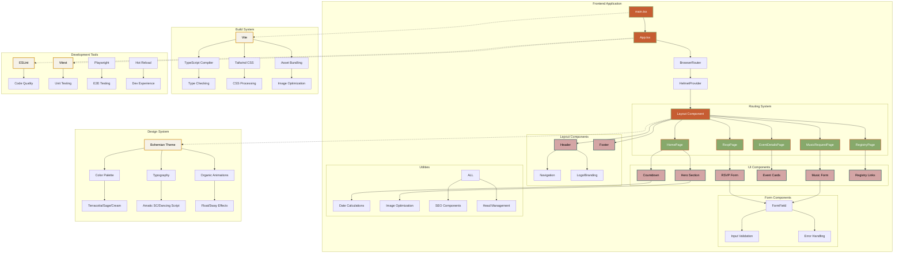
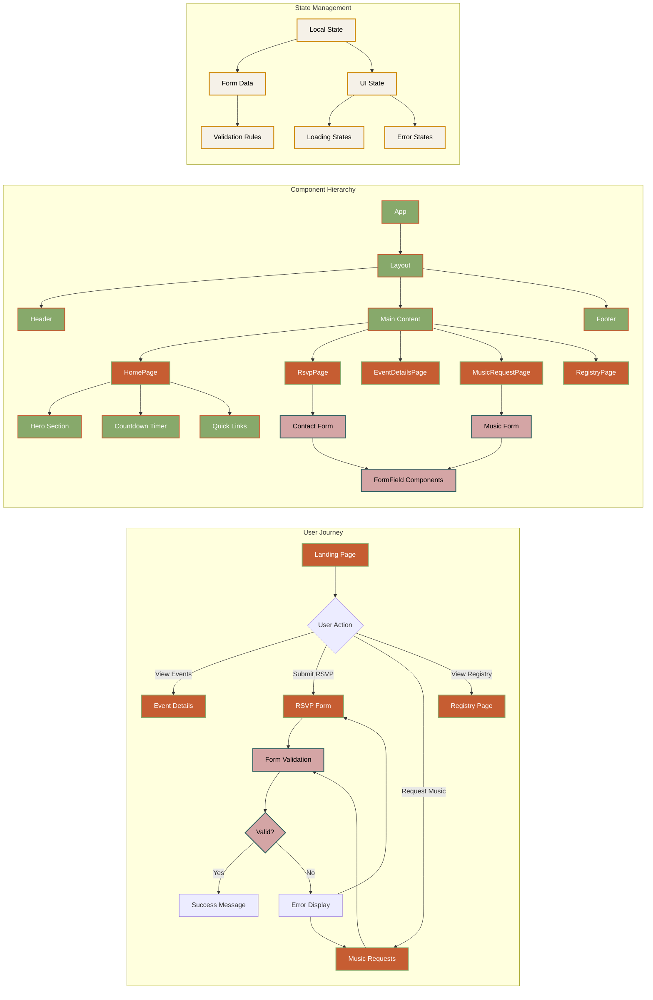

# Wedding Website Documentation

## Project Overview

A modern, elegant wedding website built with React, TypeScript, and Vite. Features a romantic bohemian design with RSVP functionality, event details, music requests, and gift registry information.

## Architecture Overview



## Component Flow Diagram



## Table of Contents

- [Getting Started](#getting-started)
- [Project Structure](#project-structure)
- [Features](#features)
- [Design System](#design-system)
- [API Documentation](#api-documentation)
- [Development Guide](#development-guide)
- [Testing](#testing)
- [Performance](#performance)
- [Deployment](#deployment)

## Getting Started

### Prerequisites

- Node.js 18.16.0 or higher
- npm 9.5.1 or higher

### Installation

```bash
# Clone the repository
git clone <repository-url>
cd vite-react-website

# Install dependencies
npm install

# Set up the database
npm run db:migrate

# Start development server
npm run dev
```

### Environment Setup

1. Copy `.env.example` to `.env.local`
2. Configure environment variables:
   ```env
   VITE_API_URL=http://localhost:3001
   DATABASE_URL=./database.sqlite
   ```

## Getting Started

1. Clean and install dependencies:

```bash
npm run clean # Optional: Use this to clean up node_modules and package-lock.json
npm install
```

2. Start the development server:

```bash
npm run dev
```

The application will be available at http://localhost:5173

## Available Scripts

- `npm run clean` - Removes node_modules directory and package-lock.json file
- `npm run dev` - Starts the development server with hot reload
- `npm run build` - Builds the application for production
- `npm run preview` - Previews the production build locally
- `npm run lint` - Runs ESLint to check code quality

## Development

The project uses:

- React with TypeScript for type-safe development
- Vite for fast development and optimized builds
- TailwindCSS for styling
- ESLint for code quality

## Technology Stack

```mermaid
graph TB
    subgraph "Frontend Framework"
        A[React 18] --> B[TypeScript]
        A --> C[React Router]
        A --> D[React Helmet Async]
        B --> E[Type Safety]
        C --> F[Client Routing]
        D --> G[SEO Optimization]
    end

    subgraph "Build & Development"
        H[Vite] --> I[Hot Module Reload]
        H --> J[Lightning Fast Builds]
        H --> K[ES Module Support]
        H --> L[TypeScript Integration]
    end

    subgraph "Styling & Design"
        M[Tailwind CSS] --> N[Utility Classes]
        M --> O[Responsive Design]
        M --> P[Custom Bohemian Theme]
        P --> Q[Terracotta Colors]
        P --> R[Organic Typography]
        P --> S[Natural Animations]
    end

    subgraph "Code Quality"
        T[ESLint] --> U[Code Standards]
        V[TypeScript] --> W[Static Analysis]
        X[Prettier] --> Y[Code Formatting]
    end

    subgraph "Testing Framework"
        Z[Vitest] --> AA[Unit Testing]
        Z --> BB[Component Testing]
        CC[Playwright] --> DD[E2E Testing]
        CC --> EE[Cross-browser Testing]
    end

    subgraph "Performance"
        FF[Lazy Loading] --> GG[Code Splitting]
        HH[Image Optimization] --> II[WebP/AVIF Support]
        JJ[Bundle Analysis] --> KK[Size Optimization]
    end

    A -.-> H
    M -.-> H
    T -.-> H
    Z -.-> H

    classDef framework fill:#c65d32,stroke:#87a96b,stroke-width:2px,color:#fff
    classDef build fill:#87a96b,stroke:#c65d32,stroke-width:2px,color:#fff
    classDef styling fill:#d4a5a5,stroke:#2f5f5f,stroke-width:2px,color:#000
    classDef quality fill:#f5f1e8,stroke:#cc8400,stroke-width:2px,color:#000

    class A,B,C,D framework
    class H,I,J,K,L build
    class M,N,O,P,Q,R,S styling
    class T,U,V,W,X,Y,Z,AA,BB,CC,DD,EE,FF,GG,HH,II,JJ,KK quality
```



## Project Structure

```
## Project Structure

```

vite-react-website/
├── public/ # Static assets served directly
│ ├── icons/ # App icons and favicons
│ └── images/ # Public images and graphics
├── src/ # Application source code
│ ├── components/ # Reusable UI components
│ │ ├── forms/ # Form-specific components
│ │ ├── layout/ # Layout components (Header, Footer, Layout)
│ │ ├── seo/ # SEO and meta components
│ │ └── ui/ # Generic UI components
│ ├── pages/ # Page components (route destinations)
│ │ ├── HomePage.tsx # Landing page with hero and overview
│ │ ├── RsvpPage.tsx # RSVP form and guest management
│ │ ├── EventDetailsPage.tsx # Wedding event details and timeline
│ │ ├── MusicRequestPage.tsx # Music request form
│ │ └── RegistryPage.tsx # Gift registry information
│ ├── assets/ # Static assets for bundling
│ │ ├── images/ # Component-specific images
│ │ └── styles/ # Additional stylesheets
│ ├── test/ # Test utilities and setup
│ ├── App.tsx # Root application component
│ ├── main.tsx # Application entry point
│ ├── index.css # Global styles and Tailwind imports
│ └── vite-env.d.ts # Vite environment type definitions
├── tests/ # Test suites
│ ├── e2e/ # End-to-end tests (Playwright)
│ └── unit/ # Unit and integration tests
├── docs/ # Project documentation
├── .github/ # GitHub workflows and templates
├── tailwind.config.js # Tailwind CSS configuration
├── vite.config.ts # Vite build configuration
├── tsconfig.json # TypeScript configuration
├── package.json # Dependencies and scripts
└── README.md # Project documentation

```

### Key Directories Explained

- **`src/components/`** - Modular, reusable components organized by purpose
- **`src/pages/`** - Top-level page components that correspond to routes
- **`src/assets/`** - Static assets that get processed by Vite's build system
- **`public/`** - Static files served directly without processing
- **`tests/`** - Comprehensive testing setup with unit and E2E tests

## Features
```

## Building for Production

To create a production build:

```bash
npm run build
```

The build output will be in the `dist` directory.
